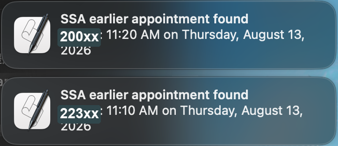

# ssa-earlier-slot-alert

A conservative Playwright-based watcher that checks SSA appointment availability across multiple ZIP codes and alerts when an earlier appointment appears.

This tool opens a real Chrome window and uses a persistent local browser profile. You sign in manually with SSA, Login.gov, ID.me, Face ID, passkey, or MFA. The script does not bypass authentication, solve CAPTCHA, store passwords, or automatically reschedule appointments.

## Motivation

An SSN can be especially important for international students who are starting work, onboarding with employers, setting up payroll, or completing other employment-related paperwork. In practice, EAD card processing can already take a long time, and students who wait until after EAD approval to book an SSA appointment may only find openings well after their OPT start date.

This project was built to reduce that manual checking burden. It watches for earlier SSA appointment openings across several nearby ZIP codes and sends a local alert when a better slot appears, while still leaving sign-in and any appointment changes under the user's manual control.

## What It Does

- Checks multiple ZIP codes one at a time.
- Compares available appointment dates against your current appointment date.
- Sends a local macOS notification when it finds an earlier available appointment.
- Keeps your signed-in browser session in a local Playwright Chrome profile.
- Saves optional debug snapshots when the SSA page layout changes or parsing needs adjustment.

## Setup

```bash
npm install
npx playwright install chromium
cp config.example.json config.json
```

Edit `config.json` before running:

```json
{
  "startUrl": "The link provided in your Appointment Confirmation",
  "zipCodes": ["XXXXX", "OOOOO", "ZZZZZ"],
  "currentAppointmentDate": "YYYY-MM-DD",
  "checkEveryMinutes": 10,
  "betweenZipDelayMs": 8000,
  "browserProfileDir": ".ssa-browser-profile",
  "headless": false,
  "notifyOnEveryEarlierResult": false,
  "debugSnapshots": true
}
```

Important fields:

- `zipCodes`: ZIP codes to check.
- `currentAppointmentDate`: your existing appointment date in `YYYY-MM-DD` format.
- `checkEveryMinutes`: delay between full check rounds. Use 10 minutes or longer for normal use.
- `betweenZipDelayMs`: delay between ZIP searches. Use 5000-8000 ms or longer for normal use.
- `debugSnapshots`: writes page text, HTML, and screenshots to `work/debug/` for troubleshooting.

`config.json` is intentionally ignored by git because it can contain personal appointment details.

## Run

```bash
npm start
```

First run:

1. Chrome opens.
2. Sign in manually if SSA asks for Login.gov, ID.me, Face ID, passkey, or MFA.
3. Navigate to the SSA page with the `Enter ZIP Code` field.
4. Wait for any `Loading, Please Wait` overlay to finish.
5. Return to the terminal and press Enter.

The script then checks each ZIP code in sequence, waits for the configured interval, and repeats.

## Result Preview

When an earlier appointment is found, the watcher sends a local macOS notification with the ZIP code and available time.



The terminal also prints each ZIP code as it is checked:

```text
Starting round at 6/22/2026, 1:01:35 AM
Checking ZIP 22304...
ZIP 22304: earliest date found is 2026-08-13.
Checking ZIP 20024...
ZIP 20024: earliest date found is 2026-08-13.
Round finished. Waiting 10 minute(s)...
```

The screenshot above uses redacted ZIP codes. Before sharing your own screenshots publicly, redact exact ZIP codes, appointment links, confirmation codes, names, addresses, and any browser profile or session details.

## Test

```bash
npm run check
```

This validates the JavaScript syntax. Real SSA page behavior still needs to be tested manually because authentication and appointment availability are account/session-specific.

## Safety Notes

- Do not run many browser windows or tabs in parallel.
- Do not use very short polling intervals outside brief testing.
- Do not store SSA, Login.gov, or ID.me passwords in code.
- Do not commit `.ssa-browser-profile/`, `config.json`, or `work/debug/`.
- If the session expires or SSA asks for authentication again, complete it manually.
- This script only alerts. It does not automatically choose or confirm a new appointment.

## Troubleshooting

If the script says it cannot find the ZIP field, confirm Chrome is on the page that contains `Enter ZIP Code`, not an SSA navigation error page.

If the script finds no dates or the page layout changes, check the latest files in:

```text
work/debug/
```

Those snapshots are local debugging artifacts and should not be pushed to GitHub.
